# Creating an instance

1. After creating your Google Cloud account go to https://console.cloud.google.com/
don't use My First Project (looks unprofessional). Go to the project you created

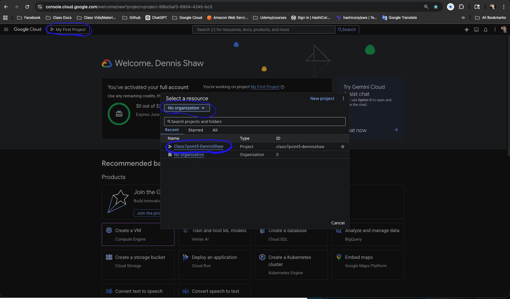

2. Create a VM
- click the box or search for Create VM in the search box at the top

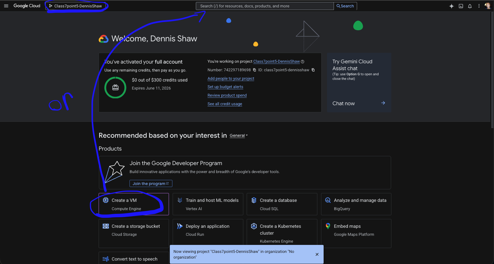

3. see the menu on the left hand side:
- note: don't click create until the end after you've gone through all the section's changes (1-7)

#### 1. Machine configuration (no changes)
  
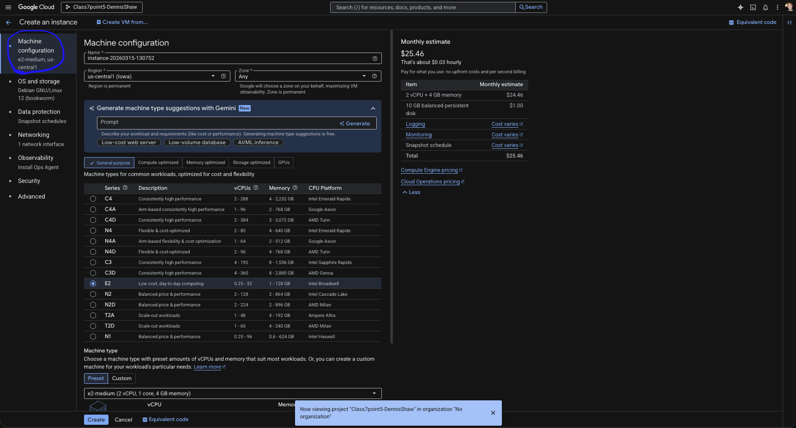

#### 2. OS and Storage (no changes)

**Debian** GNU/Linux 12 (codename “Bookworm”) is a free, open-source operating system based on Linux. It’s known for being stable, secure, and reliable, which is why it’s widely used for servers, cloud systems, and development environments.
#### 3. Data Protection (select No backups)

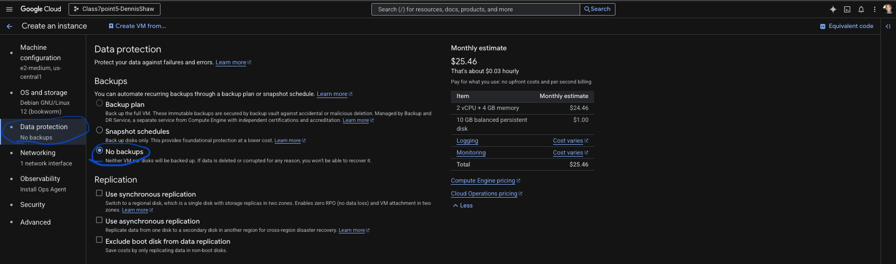

- no backup because its a lab
- with production we use backups
  
#### 4. Network  

- check Allow HTTP


#### 5. Observability (no changes)

#### 6. Securtity (no changes)

#### 7. Advanced

- [`user scripts`](https://github.com/BalericaAI/SEIR-1/tree/main/weekly_lessons/weeka/userscripts)

- copy (startup script a.k.a. user data) and paste it in Automation box 


 
- click - Create
  


#### Verify it works
- copy the External IP add "http://" example http://136.112.135.44


- paste into your browser to verify

<sub>[Back to TOC](#table-of-contents)</sub>

---

# Deliverables

Show your work:

#### 1) Browser proof
        Open: http://<EXTERNAL_IP>/

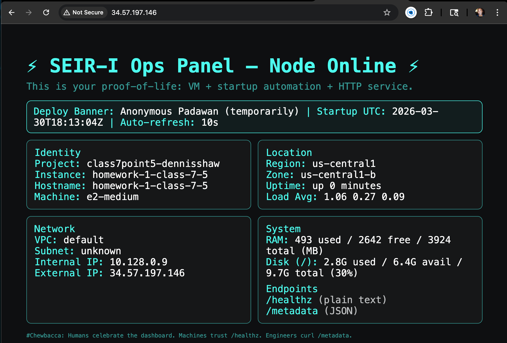

#### 2) SSH into your VM and run curl commands

**How to confirm it works using a curl command**
- can get the curl commands 
  - https://github.com/BalericaAI/SEIR-1/blob/main/weekly_lessons/weeka/weeka.txt

**Open up your ssh in GCP**

- click on the `ssh`
  
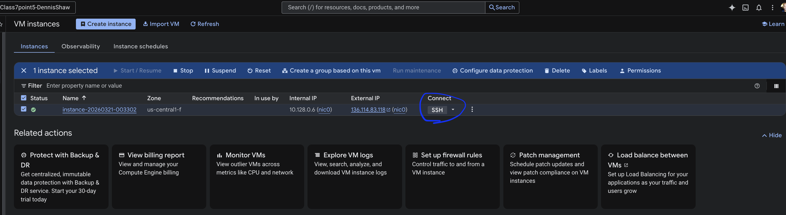
  
- it opens up the SSH-in-browser
- Authorize


```bash
curl localhost #sends a request from your vm to your local and asks, “Hey, is there a web server running on this machine? If so, give me the response.”
```
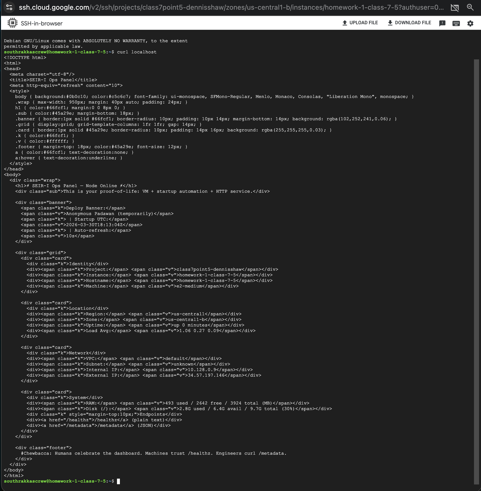

```bash
curl -s localhost | head # quietly fetches the local web page and shows only the first 10 lines
```
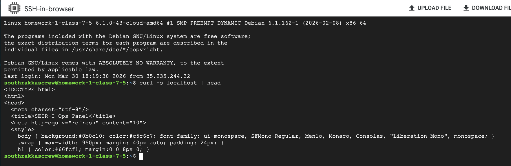

#### 3) Service proof run

```bash
systemctl status nginx --no-pager #shows nginx service status without opening the interactive pager
```

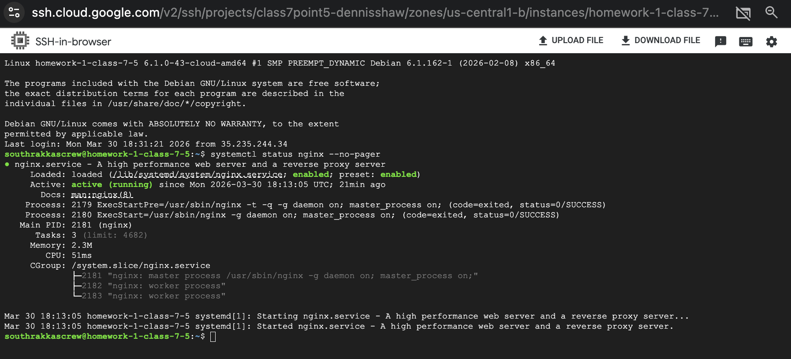

### If you use supera.sh then....

#### 1) Machine proof
```bash
curl -s localhost/healthz #quietly checks the health endpoint and returns "ok" if the service is running
```

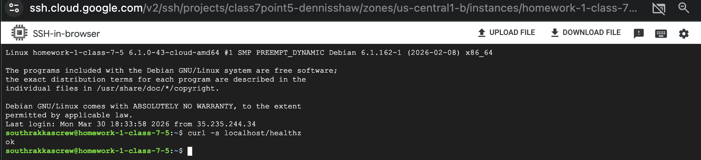

#### 1) Engineer proof 

```bash
curl -s localhost/metadata | jq . # fetches JSON metadata from the service and pretty-prints it
```
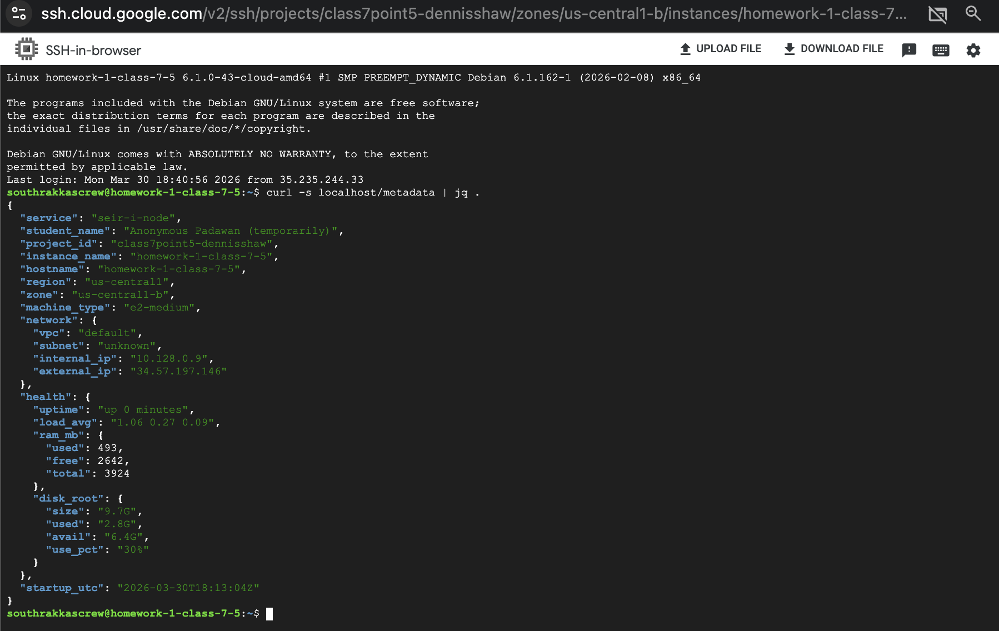

### SEIR-I Lab 1 Gate Philosophy 

Real engineers never say: --> “It works on my screen.”

They prove:
- The service is reachable
- The health endpoint works
- The metadata endpoint returns valid JSON
- The deployed infrastructure identifies itself

So the gate script checks exactly those things.

#### Lab 1 Gate Script

Copy this file

- https://github.com/BalericaAI/SEIR-1/blob/main/weekly_lessons/weeka/script/gate_gcp_vm_http_ok.sh

#NOTE!!!! You need to find the IP and change it! 
get the External IP from your VM and in your 

`gate_gcp_vm_http_ok.sh` file that you created

file replace `VM_IP=<external_ip> /gate_gcp_vm_http_ok.sh` with your own IP.

Will look somthing like this:

- `VM_IP=34.57.197.146 ./gate_gcp_vm_http_ok.sh`

in ssh run:

```bash
curl -O https://raw.githubusercontent.com/BalericaAI/SEIR-1/main/weekly_lessons/weeka/script/gate_gcp_vm_http_ok.sh
```

```bash
chmod +x gate_gcp_vm_http_ok.sh
```

```bash
VM_IP=34.57.197.146 ./gate_gcp_vm_http_ok.sh
```

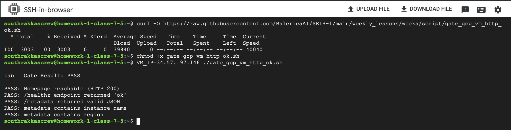

Files created:
- ls in ssh

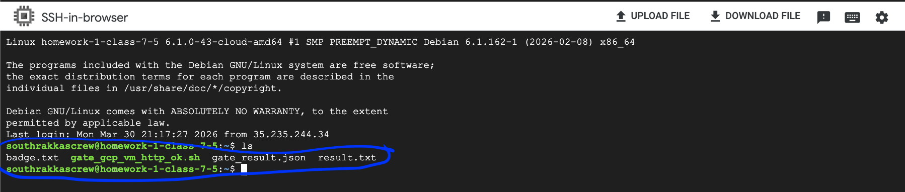


cat gate_result.json | jq .

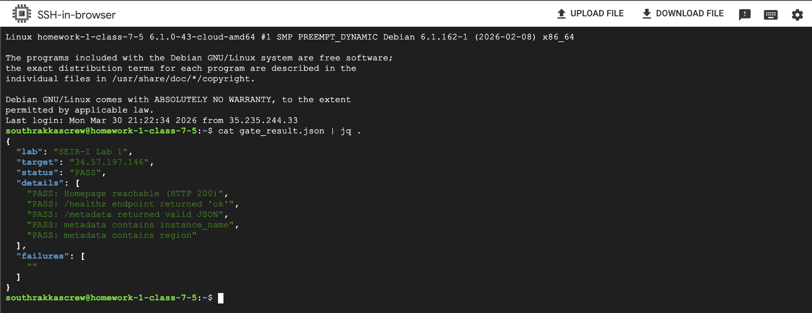

<sub>[Back to TOC](#table-of-contents)</sub>

---

# 6) Teardown 
- click instances and press delete

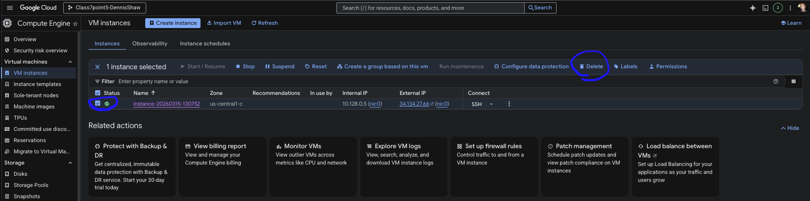

<sub>[Back to TOC](#table-of-contents)</sub>

---

