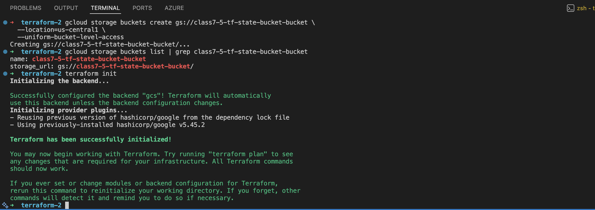
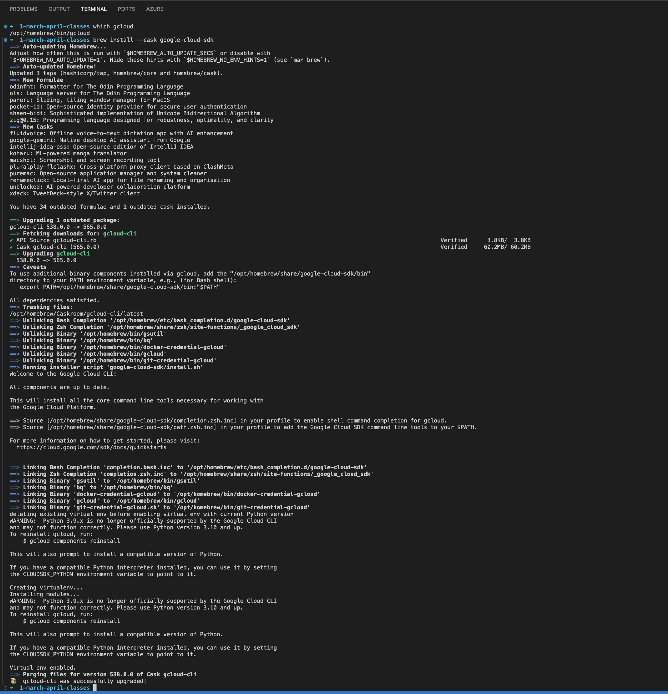
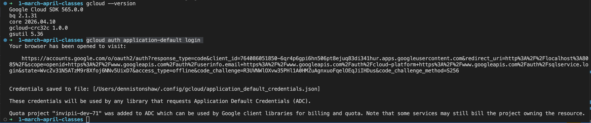
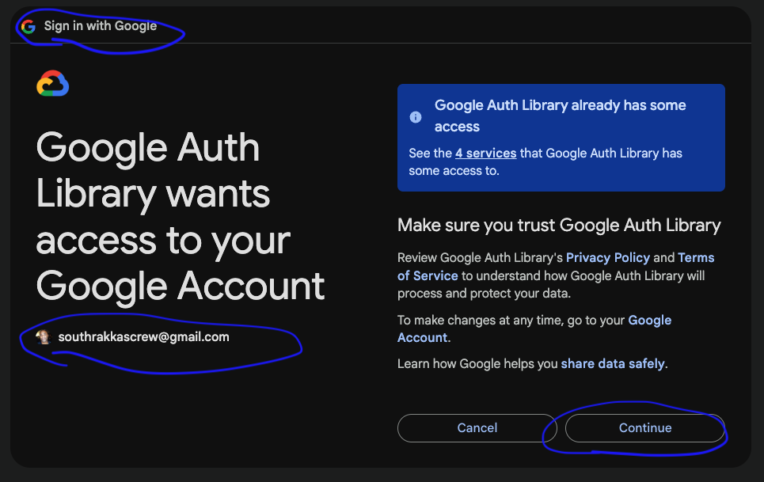
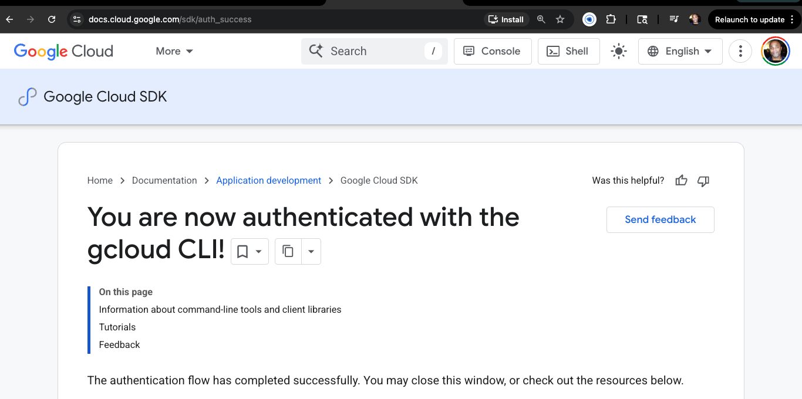
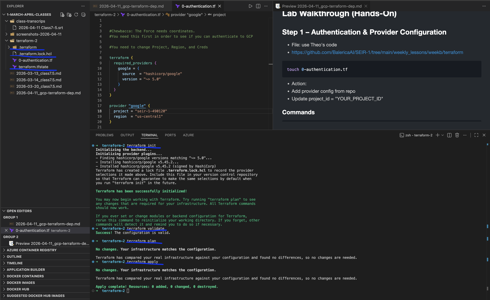
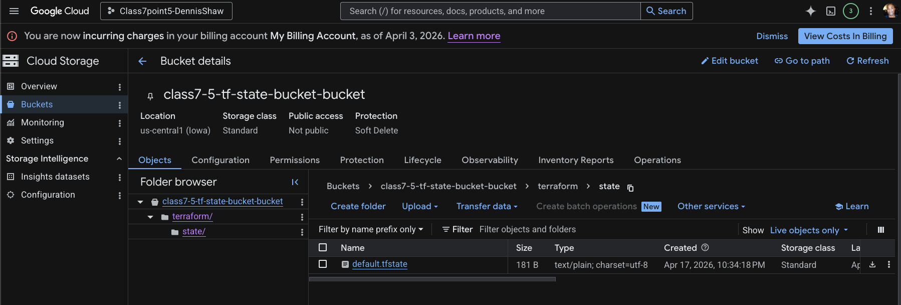
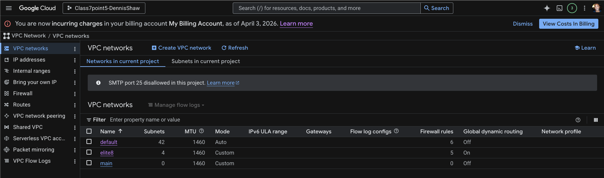
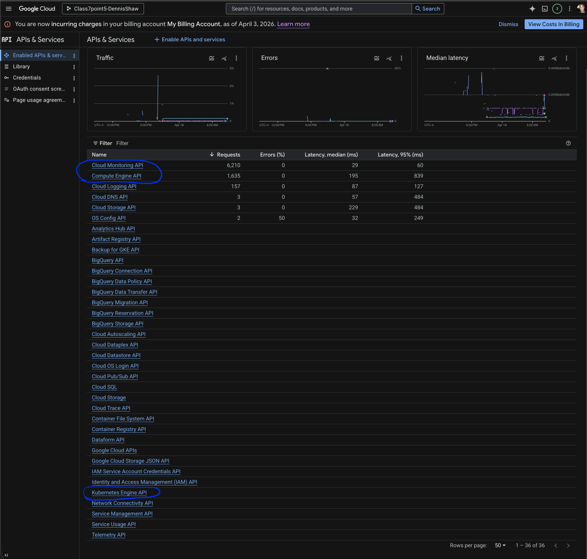
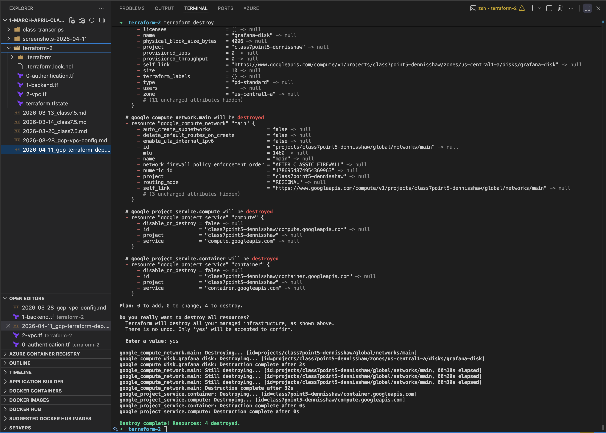

# 2026-04-11_gcp-terraform-dep.md
https://github.com/BalericaAI/SEIR-1/blob/main/weekly_lessons/weekb/terraform_basics.txt

## Table of Contents

- [Topic](#topic)
- [Goal for This Lab](#goal-for-this-lab)
- [Prerequisite: Create GCS Bucket for Terraform Backend](#prerequisite-create-gcs-bucket-for-terraform-backend)
- [Initial Setup & Authentication](#initial-setup--authentication)
  - [Prerequisites](#prerequisites)
  - [Authenticate with GCP](#authenticate-with-gcp)
  - [Project Setup](#project-setup)
- [Lab Walkthrough (Hands-On)](#lab-walkthrough-hands-on)
  - [Step 1 – Authentication & Provider Configuration](#step-1--authentication--provider-configuration)
  - [Step 2 – Backend Configuration (Remote State)](#step-2--backend-configuration-remote-state)
  - [Step 3 – Deploy VPC](#step-3--deploy-vpc)
- [Resource Management](#resource-management)
  - [Destroy Infrastructure](#destroy-infrastructure)
- [Key Concepts](#key-concepts)
- [Commands Reference](#commands-reference)
- [Rebuild Flow](#rebuild-flow)
- [Next Steps](#next-steps)
- [Notes](#notes)

---

## Topic
GCP Terraform Deployment

---

## Goal for This Lab

- Authenticate Terraform with GCP using ADC
- Configure Terraform provider and backend
- Deploy a VPC using Terraform
- Understand state (local vs remote)
- Capture screenshots for each step
- Be able to fully rebuild from scratch

---

## Prerequisite: Create GCS Bucket for Terraform Backend

- Terraform GCS backend requires the bucket to exist before `terraform init`
- Bucket names must be globally unique

```bash
gcloud storage buckets create gs://<your-unique-bucket-name> \
  --location=us-central1 \
  --uniform-bucket-level-access
```

- Replace `<your-unique-bucket-name>` with your own value
- This bucket will be used for remote Terraform state



---
## Initial Setup & Authentication

### Prerequisites

- Install gcloud SDK

#### Mac

```bash
brew install --cask google-cloud-sdk
```



verify install

```bash
gcloud --version
```



---

### Authenticate with GCP

- Run:
```bash
gcloud auth application-default login
```

- Confirm:
  - Browser login completes
  - Credentials stored locally

- Notes:
- Creates Application Default Credentials (ADC)
- Allows Terraform to authenticate without service account keys





---

### Project Setup

- Create project folder:
  - this code creates and folder and puts you in that folder in terminal
  
```bash
mkdir terraform-2 && cd terraform-2
```

- Opens youup in VS Code in the correct folder:

```bash
code .
```

---

## Lab Walkthrough (Hands-On)

### Step 1 – Authentication & Provider Configuration

- File: use Theo's code 
- https://github.com/BalericaAI/SEIR-1/tree/main/weekly_lessons/weekb/terraform
  
```bash
touch 0-authentication.tf
```

- Action:
- Add provider config from repo
- Update project_id = "YOUR_PROJECT_ID"

#### Commands (IVPAD)

```bash
terraform init
terraform validate
terraform plan
terraform apply
```

- Confirm:
- No resources created
- No errors

- Screenshot:

`0-authentication.tf`


---

### Step 2 – Backend Configuration (Remote State)

- File:

```bash
touch 1-backend.tf
```

- Action:
- Add backend config from repo
- Update `bucket = "YOUR_GCS_BUCKET"`
- Create the GCS bucket before running `terraform init`

#### Commands

```bash
terraform init
terraform validate
terraform plan
terraform apply
```

- Notes:
- Terraform backend bucket must already exist before `terraform init`
- A state migration prompt only appears if Terraform already has local state to move into the GCS backend
- If no local state exists yet, no migrate prompt will appear

- Screenshot:

`Confirm the bucket and .tfstate file`


---

### Step 3 – Deploy VPC

- File:

```bash
touch 2-vpc.tf
```

- Action:
  - Add VPC (Virtual Private Cloud) config from repo

#### Commands

```bash
terraform validate
terraform plan
terraform apply
```

- Confirm:
- 3 resources created

- Screenshot:
  
VPC networks page


Enable APIs & Services in the search bar

API page


---

## Resource Management

### Destroy Infrastructure

```bash
terraform destroy
```

- Confirm:
- Type `yes`

- Screenshot:

terraform destroy


---

## Key Concepts

- Terraform uses state to track infrastructure
- Local state is default
- Remote state (GCS) is best practice
- Some resources are immutable and require recreation

---

## Commands Reference

- `gcloud auth application-default login`
- `terraform init`
- `terraform validate`
- `terraform plan`
- `terraform apply`
- `terraform destroy`

---

## Rebuild Flow

- gcloud auth application-default login
- terraform init
- terraform validate
- terraform plan
- terraform apply
- verify resources
- terraform destroy

---

## Next Steps

- Complete Udemy homework
- Submit proof (screenshot or summary)
- Run terraform destroy to avoid charges

---

## Notes

- Do NOT delete Terraform state files
- Always review terraform plan before apply
- Use remote state for real environments
- Avoid manual changes in GCP console