# 2026-03-28_gcp-vpc-config.md

youtube class vid - https://youtu.be/5cs8MflDnB4?si=SQAhHKRWe25bBx3p

## Table of Contents

- [Topic](#topic)
- [Goal for This Lab](#goal-for-this-lab)
- [Key Concepts](#key-concepts)
- [RFC 1918 (Private IP Ranges)](#rfc-1918-private-ip-ranges)
- [Network Planning](#network-planning)
- [Lab Walkthrough (Hands-On)](#lab-walkthrough-hands-on)
  - [Step 1 – Create Custom VPC](#step-1--create-custom-vpc)
  - [Step 2 – Create VM Instance](#step-2--create-vm-instance)
  - [Step 4 – Verify VM (Internal)](#step-4--verify-vm-internal)
  - [Step 5 – Verify VM (External)](#step-5--verify-vm-external)
- [Next Steps](#next-steps)

---

## Topic

GCP Custom VPC Configuration & VM Deployment

---

## Goal for This Lab

- Create a custom VPC in GCP
- Design subnets using RFC 1918 private IP ranges
- Deploy VMs into the custom VPC
- Configure networking and firewall rules
- Verify connectivity and web server functionality

---

## Key Concepts

- VPCs are isolated private networks in GCP
- Default VPC is for testing only (not production)
- Custom VPCs are required for real environments
- Subnets must use RFC 1918 private IP ranges
- VMs must be explicitly attached to the correct VPC

---

## RFC 1918 (Private IP Ranges)

- 10.0.0.0/8 - 10.255.255.255 (10/8 prefix)
- 172.16.0.0/12 - 172.31.255.255 (172.16/12 prefix)
- 192.168.0.0/16 - 192.168.255.255 (192.168/16 prefix)

- These ranges:
  - Are NOT routable on the internet
  - Provide secure internal networking

to see your personal IP addresses

```bash
ipconfig getifaddr en0
```

for your public ip

```bash
curl ifconfig.me
```

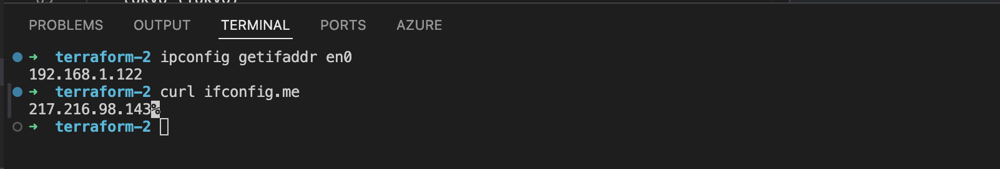

---

## Network Planning

Example:

- VPC Name: elite-eight

- Subnets:

| Region | IP |
| --- | --- |
| illini (Iowa) | 192.168.100.0/24 |
| sao-paulo (Sao Paulo) | 192.168.120.0/24 |
| tokyo (Tokyo) | 192.168.140.0/24 |
|vincent-lizzo-booty (Mumbai)|192.168.69.0/24|

---

## Lab Walkthrough (Hands-On)

### Step 1 – Create Custom VPC
**⏱ Timestamp: ~11:00 – 37:00**

- Go to GCP console -> VPC networks → Create VPC network
  - Configure:
    - Name:
      - elite-eight
    - Description:
      - whateveryouwant
  
  - Subnets:
    - name: illini 
    - description: illini owning Iowa
    - Region: us-central1 (Iowa)
    - IPv4 range: 192.168.100.0/24
    - Private Google Access `ON`

Subnet Iowa
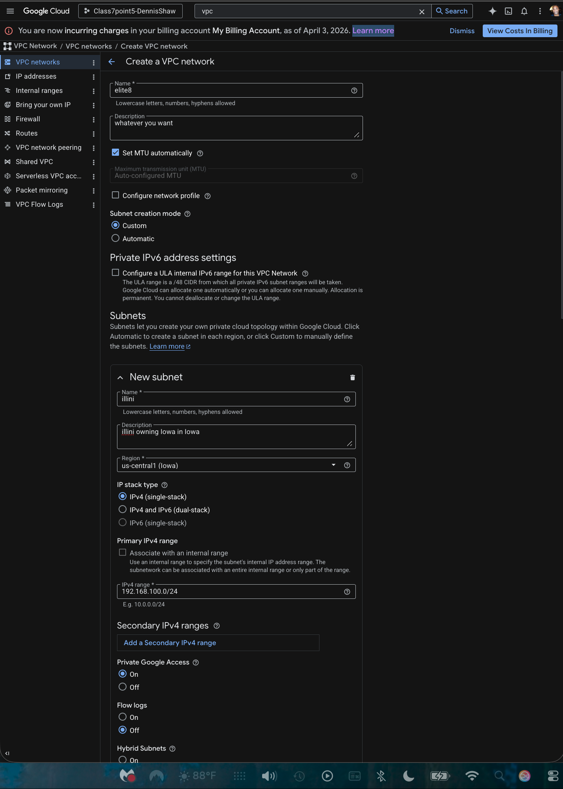

  - Add subnet and repeat steps for Sao Paulo

Subnet São Paulo
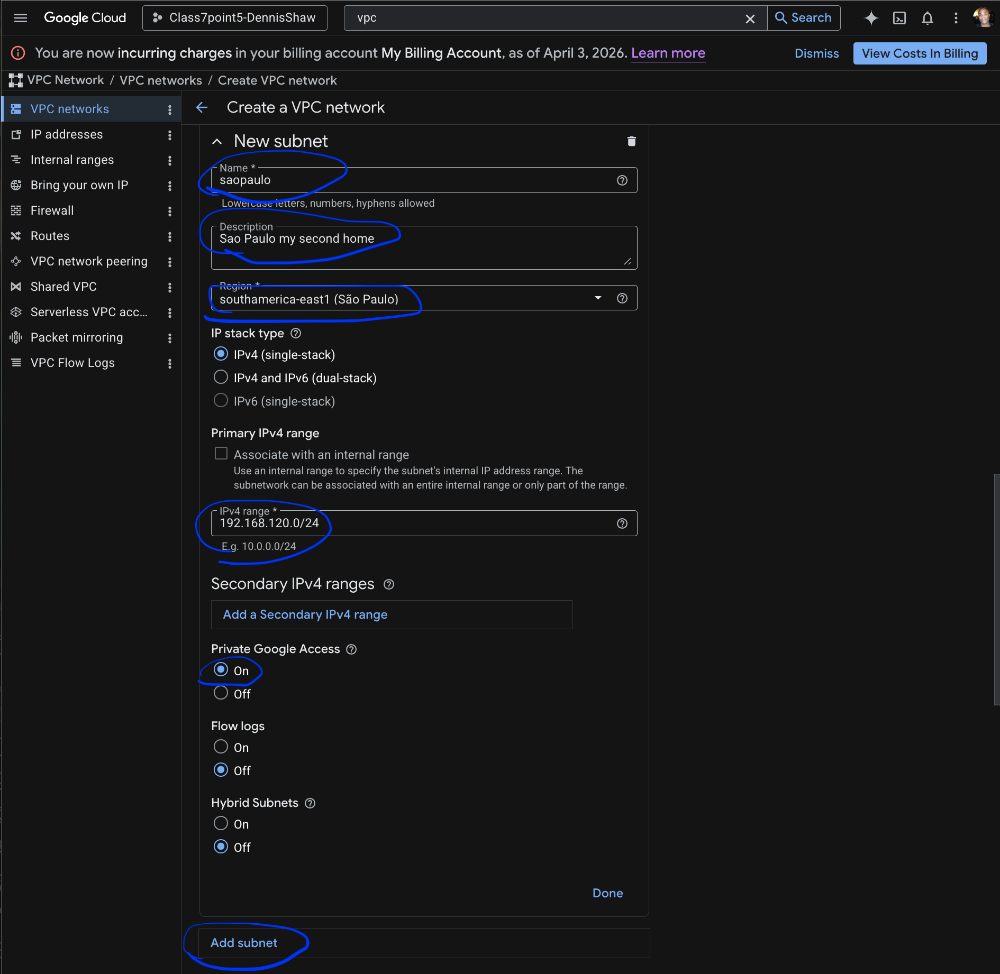

  - Add subnet and repeat steps for Tokyo

Subnet Tokyo
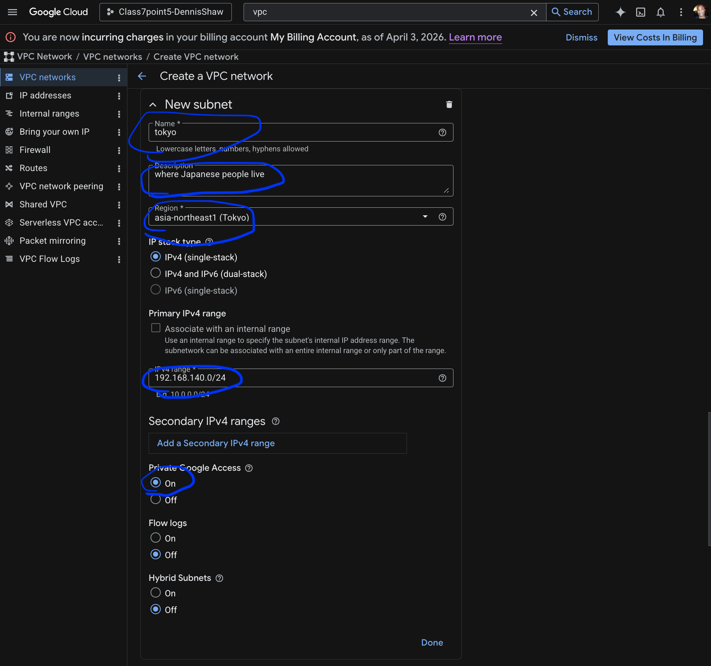

  - Add subnet and repeat steps for Mumbai

Subnet Mumbai
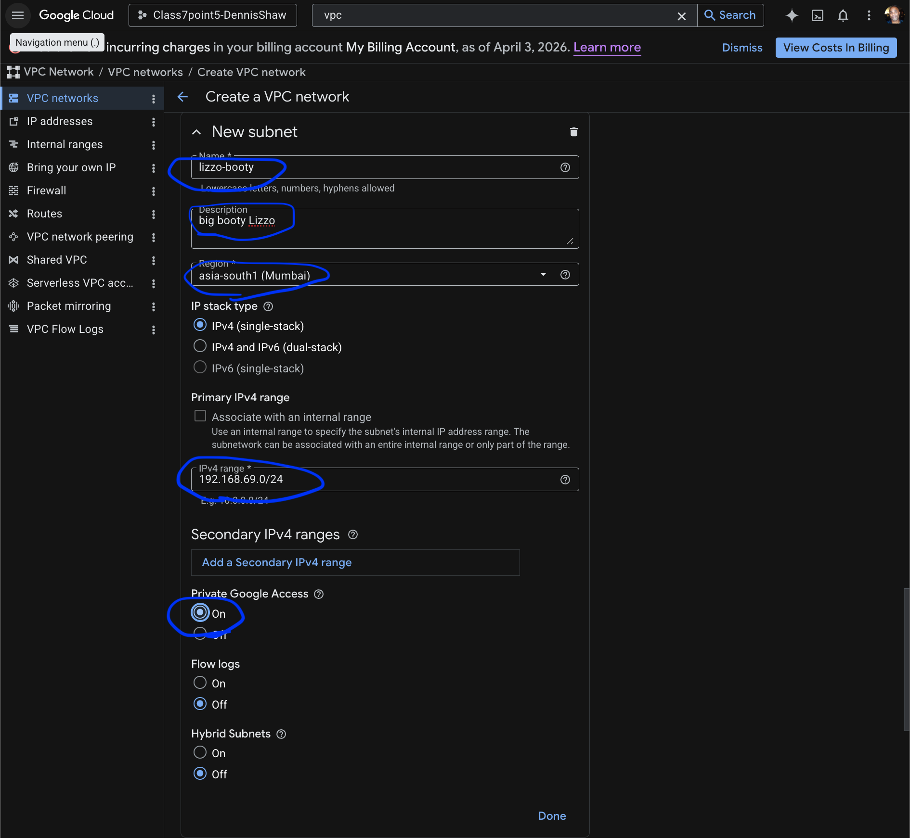

  - Firewall rules: select all
    - `Allow custom`
    - `Allow icmp`
    - `Allow rdp`
    - `Allow ssh`

  - Dynamic routing mode:
    - Global

Firewall and Dynamic Routing Mode]
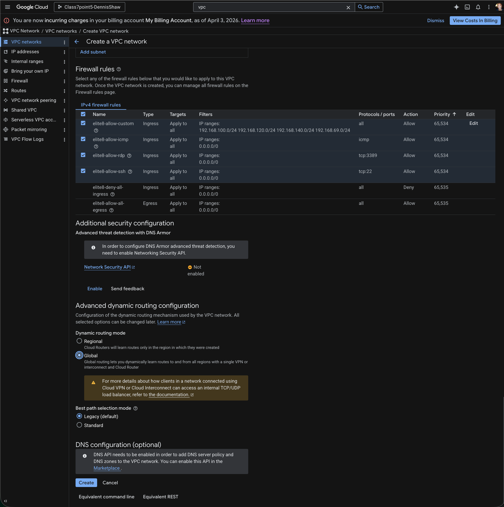

Create

- Screenshot:

VPC Creation
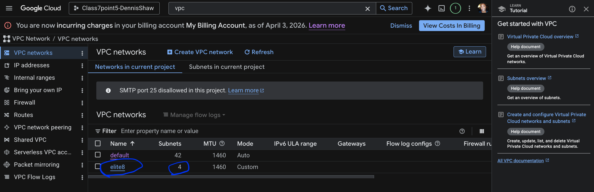

---

### Step 2 – Create VM Instance
**⏱ Timestamp: ~37:00 – 44:30**

- Go to:
  - Compute Engine → VM Instances → Create Instance

- Machine Configuration
  - name: vincent-lizzo-luver-lane
  - region: asia-south1 (Mumbai)

Machine Configuration
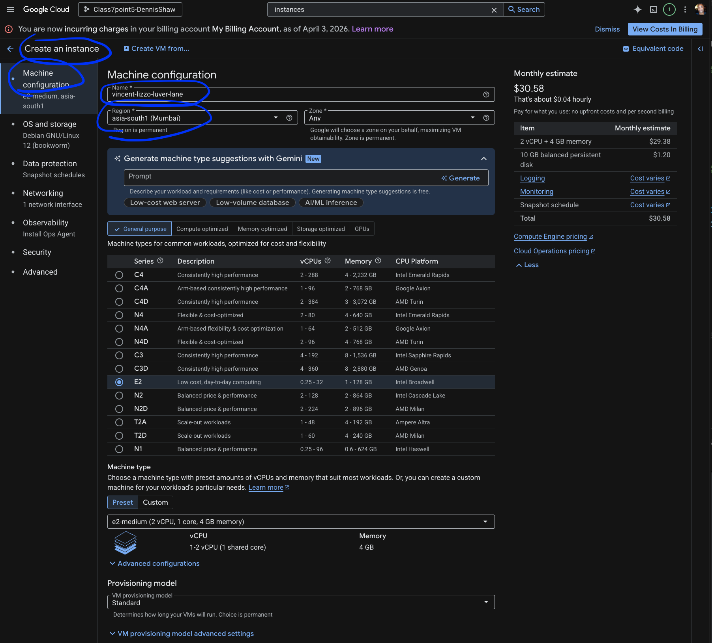

- OS and storage - null
- Data protection
  - `No backups`
- Networking:
  - `Allow HTTP traffic`
  - Unselect default network
  - Select custom VPC (elite-eight)

Data protection and Networking changes
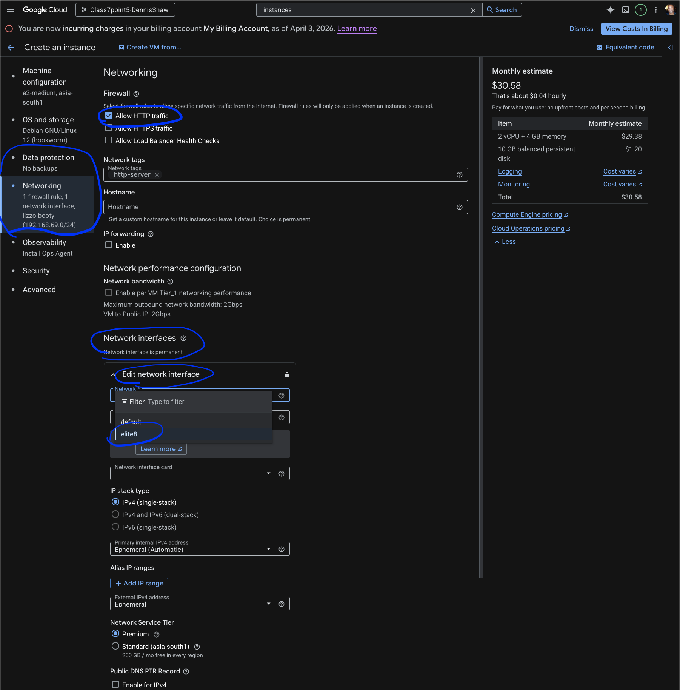

- Observability - null
- Security - null
- Advanced
  - got to Automation and paste into box `startup script` in the box. you can get the script from:
    - [get the supera.sh from Theo's Github Repo and copy userscript](https://github.com/BalericaAI/SEIR-1/blob/main/weekly_lessons/weeka/userscripts/supera.sh)
    - Purpose:
      - Installs web server
      - Displays instance metadata


Screenshot:
Advanced -> Automation -> paste startup script
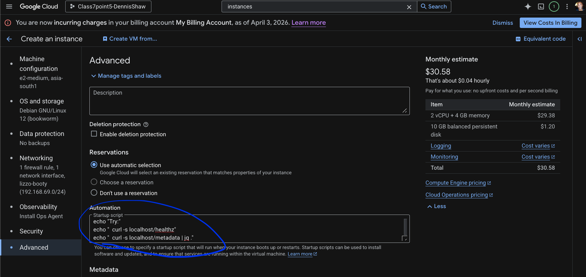

- Create

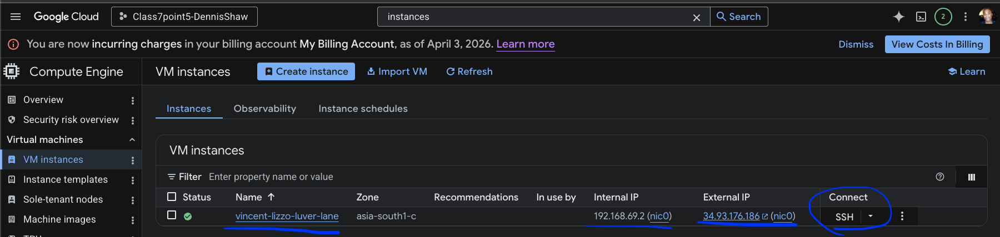

---

### Step 4 – Verify VM (Internal)
**⏱ Timestamp: ~44:30 – 46:00**

- SSH into VM

- Run:

```bash
curl -a localhost | head
```

- Confirm:
  - Web server is running
  - Output displays instance info

- Screenshot:

SSH Verification
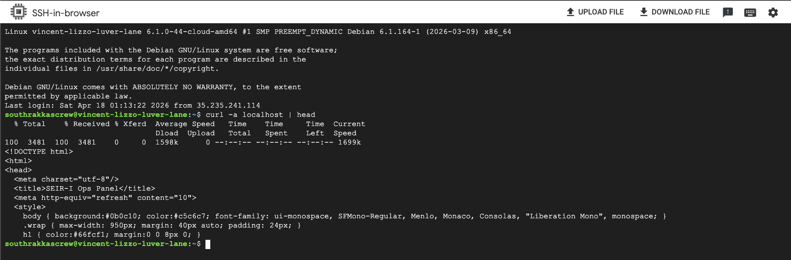

---

### Step 5 – Verify VM (External)
**⏱ Timestamp: ~46:00 – End**

- Open browser
  - copy external IP from VM instances and paste it in the browser
  
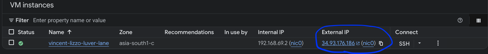

- Use:
```
http://<EXTERNAL-IP>
```

- Confirm:
  - Page loads
  - Shows instance info

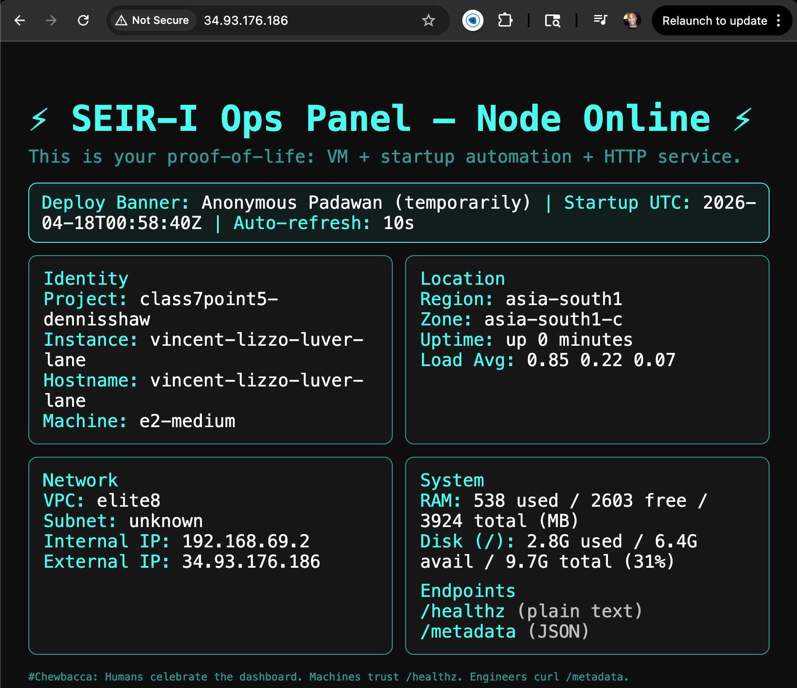

---

## Next Steps

- Recreate VPC and VMs from scratch
- Ensure all subnets are correctly assigned
- Use supera.sh for future labs
- Proceed to Terraform lab after this (bucket dependency)