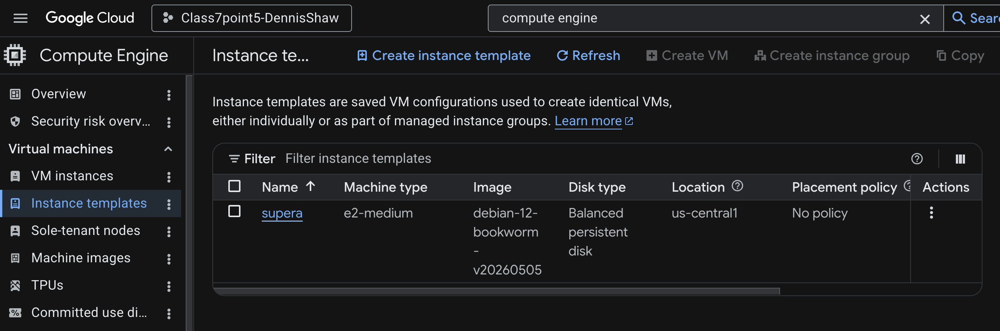
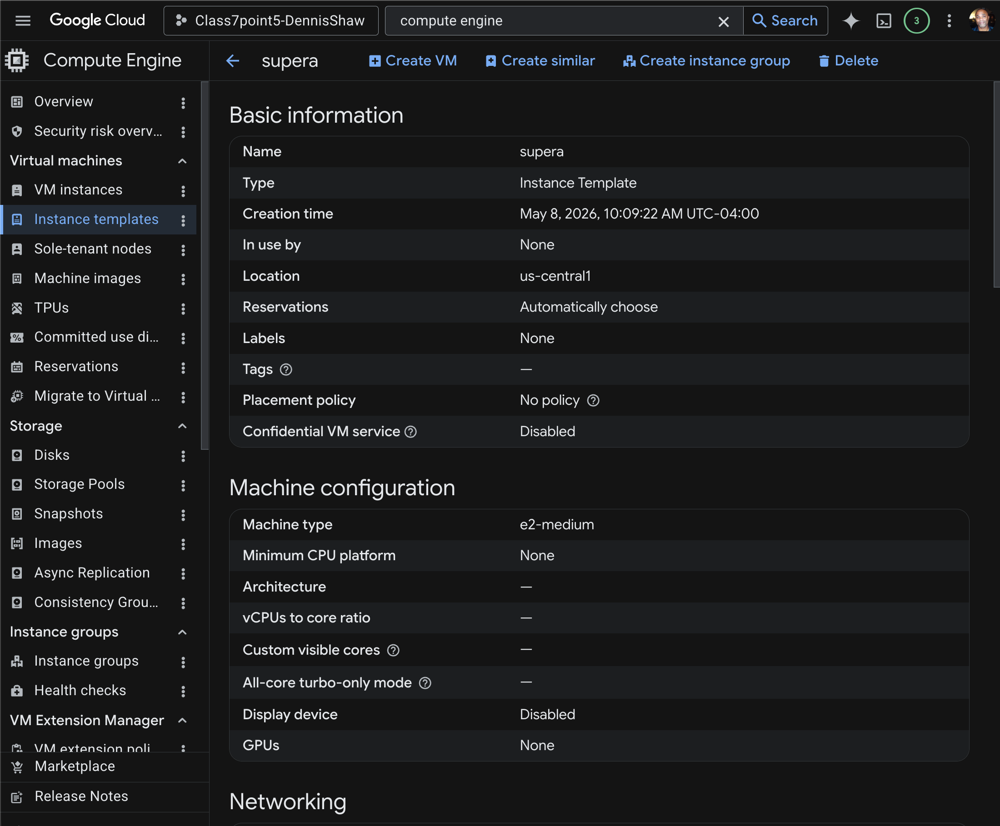
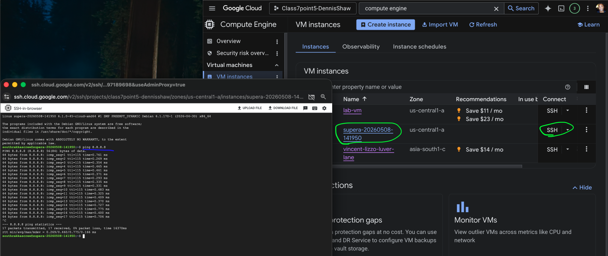
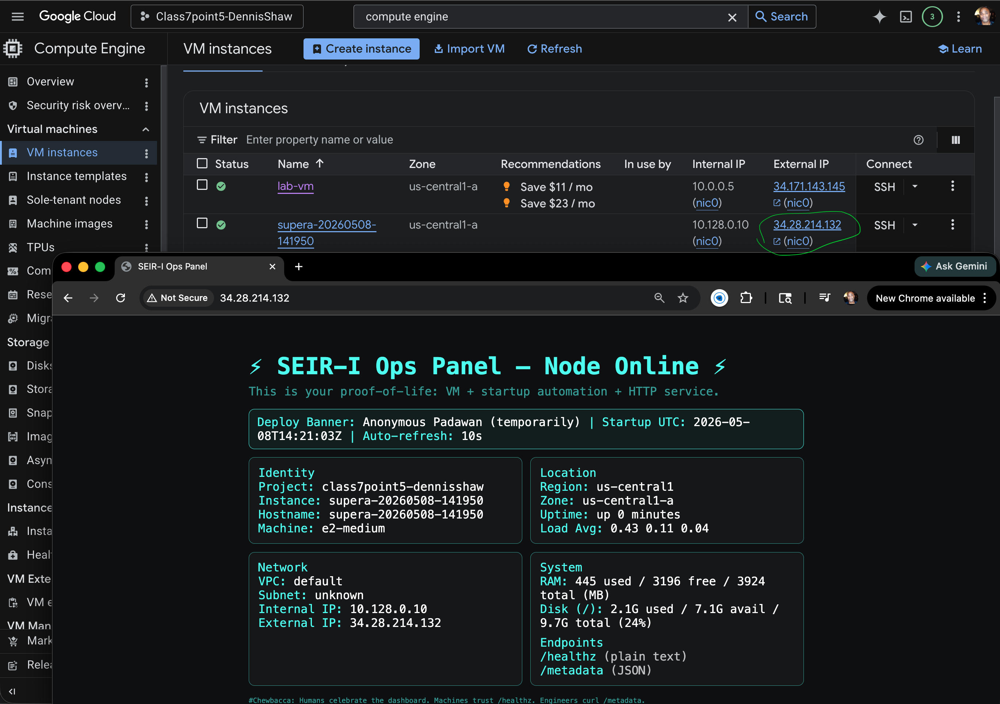
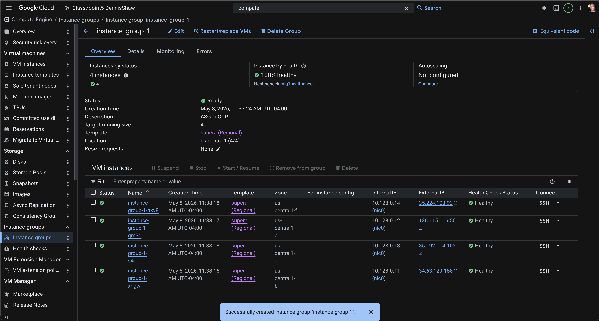
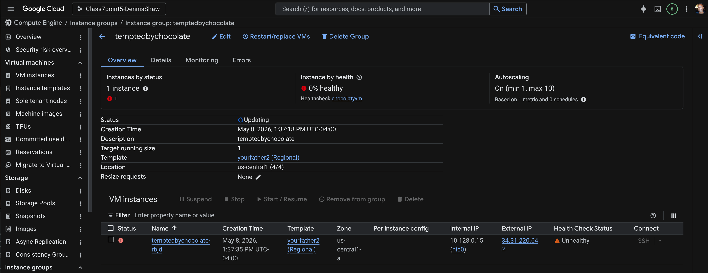
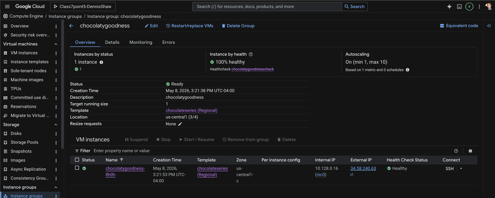
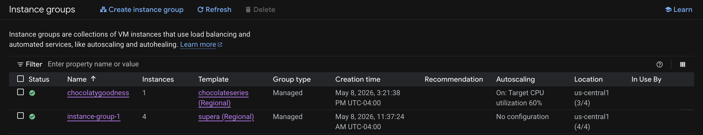
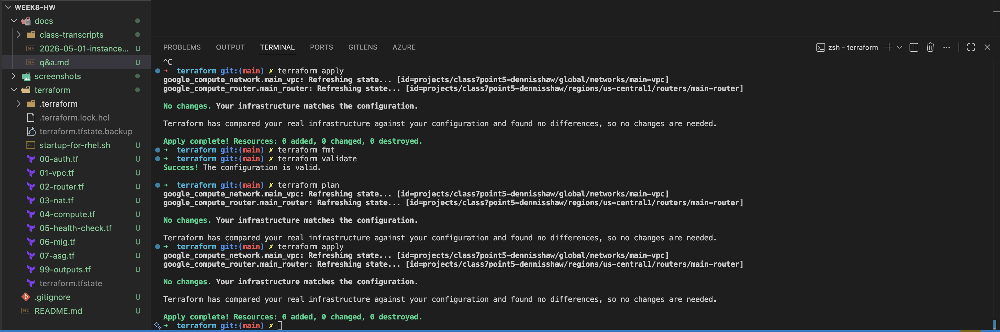
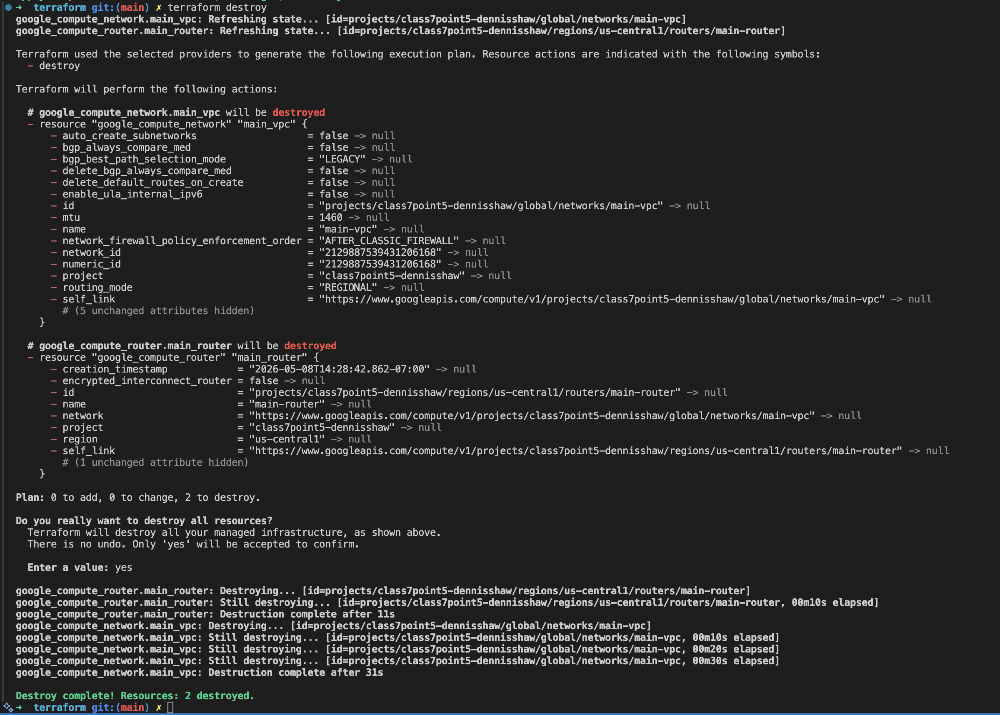

# Week8
#### Class 7.5

## Making an instance template

- go to compute engine in the search
- left menu click `instance templates`
- create instance template
- in the create instance template name it:
  - supera
- scroll down to Firewall:
  - select Allow HTTP traffic
  - open Advanced options 
  - open Networking and you will see Network tags:
    - http-server verifying your choice
    - also scroll down to Network interfaces and click `nic0 default` verify you are in default
- scroll go to Management -> Automation and in the Startup script box 
  - copy paste your supera script
  - get script from here: [github link](https://github.com/BalericaAI/SEIR-1/blob/main/weekly_lessons/weeka/userscripts/supera.sh)
- click `Create`

---

## Deploying instance

- go to VM instances
- click Create instance
- click Create VM from... (dropdown menu)
  - choose `Instance template` then choose which template from the popup
- click `Create`
- SSH into it to verify
  - run: ping 8.8.8.8

copy external IP and check in browser
- http://34.28.214.132

---

## Main thing the MIG (Managed Instance Group) is Doing

### Instance Template

Defines:
- what to create

### Managed Instance Group

Defines:
- how many instances exist
- where they exist
- how they recover
- how they scale

### Autoscaling

Controls:
- when to add/remove instances

Usually based on:
- CPU utilization

### Autohealing

Controls:
- when broken instances get recreated

Uses:
- health checks

### Regional MIG

Controls:
- multi-zone distribution
- higher availability

MIG is basically on demand scales up and down according to what it required.

---

## MIG walkthrough

- go to Compute -> Instance groups
- `Create Instance Group`
- Name it: mig1
- Description: ASG in GCP
- Instance template: supera
- Number of instances: 4
- Location: 
  - important because if you put all your instances in 1 datacenter/zone potential problem is your whole system goes down in that zone goes down.
  - use Multiple zones, click zones and choose 4 zones

Autohealing -> Health check 
- click `Create a health check`
- Name it: mig1healthcheck
- Description: mig1healthcheck
- Logs: select ON
- click `Save`
- click `Create`

---

just to practice:
 - create another instance template using yourfather.sh
 - https://github.com/BalericaAI/SEIR-1/blob/main/weekly_lessons/weeka/userscripts/yourfather2.sh

---

## Create Instance Group

- Compute Engine -> Instance Groups -> Create instance group
- Name: chocolatygoodness
- Description: chocolatygoodness
- Instance: choose template
  - yourfather2
- Number of instances: 4
- Location:
  - choose Multiple Zones 
  - choose and check 4 zones
- go to Autoscaling 

>![NOTES]:
> the purpose of autoscaling is:
>- spin up or down instances according to demand
>- to tear down unhealthy instances and spin up new healthy ones
>- Multi-zone improveds availability by spreading infrastructure across zones

  - click on `Configure Autoscaling`
  - scroll down to Autohealing
    - Health check -> dropdown
      - choose or `Create a health check`
      - New Health Check window
        - Name: chocolatyvm
        - Description: choclatyvm
        - Scope: Regional
        - Logs: On
        - Health criteria:
          - Check interval: 300 seconds
          - Timeout: 300 seconds
        - Click `Save`
- Click `Create`
  

>![NOTES]:
>- Immediately after the MIG was created, the instance showed as unhealthy because the VM and startup script needed time to finish initializing.
>- After the startup process completed and the health check had enough successful probes, the instance status changed to healthy.

Due to an error: posted the father2.sh link in the script box instead of the script. Discovered when after an hour I still couldn't get it healthy. I deleted and recreated a new Instance group.

---

#### Terraform:
- init
- validate
- plan
- apply

---

#### Tear down:
- terraform destroy

 
---

